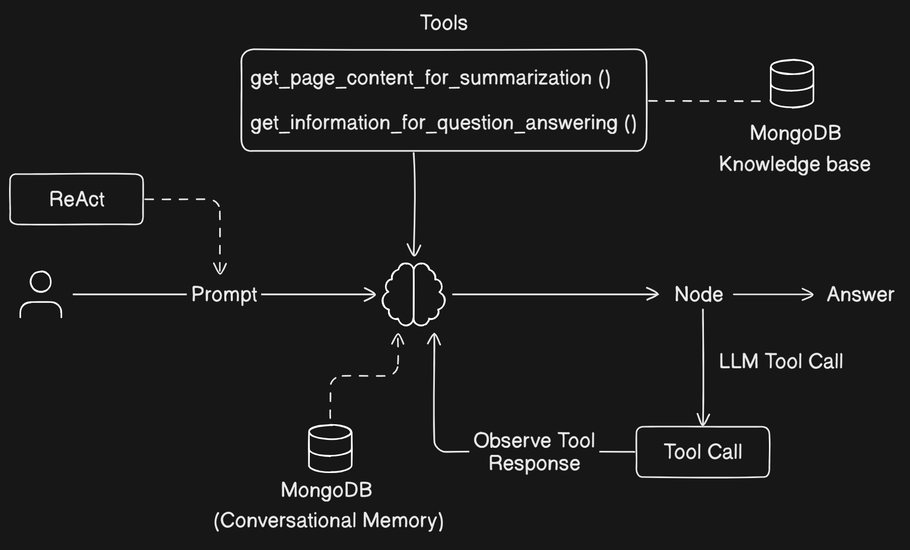

# AI Research Agent

AI Research Agent is an intelligent assistant designed to facilitate research by leveraging AI-powered document retrieval, summarization, and Q&A functionalities. It integrates MongoDB for efficient data storage and retrieval, along with LangChain for AI-based processing.

## Architectural Diagram


## Features
- **AI-powered document retrieval** using MongoDB and vector search.
- **Summarization and Q&A capabilities** with LangChain.
- **Seamless data storage** in MongoDB.
- **Embeddings for search optimization** with Sentence Transformers.

## Technologies Used
- **Python**
- **MongoDB**
- **LangChain**
- **Sentence Transformers**
- **TQDM, Pillow, and other utility libraries**

## Installation

1. Clone the repository:
   ```sh
   git clone https://github.com/yourusername/AI-Research-Agent.git
   cd AI-Research-Agent
   ```

2. Install dependencies:
   ```sh
   pip install -r requirements.txt
   ```

3. Configure MongoDB connection:
   - Update `MONGODB_URI` in the code with your database credentials.

## Usage
Run the Jupyter Notebook to execute the AI-powered research assistant:
```sh
jupyter notebook ai_research_agent.ipynb
```

## Contribution
Feel free to fork the repository, create a branch, and submit a pull request with improvements.

